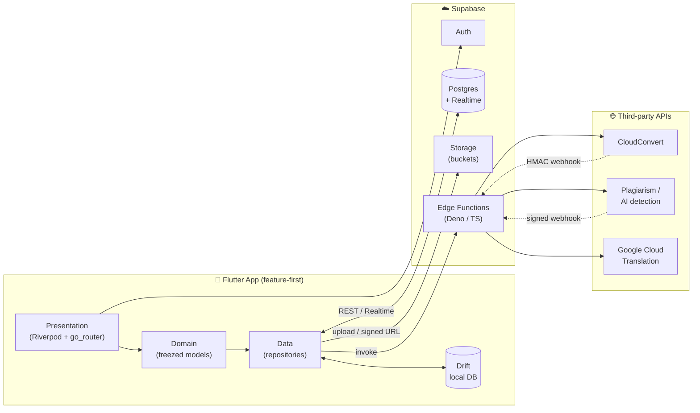

<div align="center">

# 📄 VeriScript

### Document integrity & productivity suite for students and professionals

*Plagiarism & AI‑content detection · File conversion · OCR · Document translation — fully bilingual (English / Français), built for Cameroon and beyond.*


**[⬇️ Download the latest test build (APK)](https://github.com/favour-tamfu/veriscript-mobile/releases/latest)**

</div>

---

## Overview

**VeriScript** is a mobile document toolkit that packages four commonly‑needed—but usually
scattered—document tasks into one clean, offline‑capable app: check a paper for **plagiarism and
AI‑generated content**, **convert** files between formats, **extract text from images (OCR)**, and
**translate** whole documents while preserving their layout. It is designed for the Cameroonian
market first — every screen is available in **English and French**, growth is driven through
**WhatsApp** and a **referral** system, and heavy processing runs in the cloud so it works well on
mid‑range devices.

The app is a **thin, offline‑first client** over a **Supabase** backend (Postgres, Auth, Storage,
Realtime, and Deno/TypeScript **Edge Functions**) that orchestrates best‑in‑class third‑party APIs.

> **Try it now:** grab the APK from the [latest release](https://github.com/favour-tamfu/veriscript-mobile/releases/latest)
> and install on any Android device (enable “install from unknown sources”).

<!-- Add screenshots here once captured, e.g.:
<p align="center">
  
  
  
  
</p>
-->

---

## ✨ Features

| Tool | What it does | How it works |
|------|--------------|--------------|
| 🔎 **Plagiarism & AI Detection** | Scans a document for text matched across the web and estimates the probability it was AI‑generated. Renders an **Originality Report** with a similarity score, per‑source breakdown, and an AI‑content card. | Upload → Edge Function submits the job to a third‑party detection API → results returned via a signed webhook and streamed to the UI in real time. |
| 🔄 **File Converter** | Converts between document formats (e.g. `docx → pdf`) with an in‑app download of the result. | Async job pattern: Edge Function calls **CloudConvert**; a signed **HMAC webhook** writes the output back to Storage; the screen updates live via **Supabase Realtime**. |
| 🖼️ **OCR Scanner** | Extracts editable text from a photo or gallery image, with crop and copy. | Runs **on‑device** with **Google ML Kit** — no upload, instant, works offline. |
| 🌍 **Translator** | Two modes: quick **text translation**, and **layout‑preserving document translation** (PDF/Word/PPT/Excel) that keeps fonts, tables, and images intact. | Text → Google Translate; documents → **Google Cloud Translation Advanced (v3)** via a service‑account‑authenticated Edge Function. |
| ☁️ **Google Drive** | Import source documents from Drive and save translated output back to it. | `google_sign_in` (scopes `drive.readonly` + `drive.file`) with a reusable Drive file‑picker sheet. |
| 🗂️ **Library & History** | An in‑app file library plus a searchable history of every scan, conversion, and translation. | Backed by a local **Drift** database and synced with Postgres. |
| 🔔 **Notifications** | Push notifications when long‑running scans/conversions/translations complete. | `flutter_local_notifications`, with Android 13+ runtime permission handling. |
| 🎁 **Referrals & Growth** | Referral codes grant bonus scans; one‑tap **WhatsApp** sharing tuned to local usage. | Referral tables in Postgres; `wa.me` deep links. |

**Product model:** a **Free** tier with monthly quotas (scans / conversions / translation
characters) and an unlimited **Plus** tier, with referral bonuses layered on top.

---

## 🏗️ Architecture

VeriScript follows a **feature‑first, offline‑first** architecture with a clean separation between
presentation, domain, and data layers, and Riverpod for dependency injection and state.



### How an async job flows (converter / plagiarism)

1. Client uploads the source file to a **Storage** bucket and inserts a **job row** in Postgres.
2. Client invokes the relevant **Edge Function**, which calls the third‑party API.
3. The third‑party service processes the file and calls back a **webhook** Edge Function
   (verified via HMAC / a per‑job signed URL).
4. The webhook writes the result (output path, score, status) back to Postgres.
5. The UI, subscribed via **Supabase Realtime**, updates instantly — no polling.

On‑device OCR is the exception: it runs entirely locally with ML Kit and never leaves the phone.

### Engineering highlights

- **Offline‑first** — Drift local database + a sync queue so history and library survive
  no‑connectivity sessions; a connectivity provider drives an offline banner.
- **Robust, localized error handling** — a shared `friendlyError()` mapper converts raw
  exceptions into concise EN/FR messages, and every external link is launched through a guarded
  helper so buttons never silently fail.
- **Type‑safe domain layer** — immutable models with `freezed`; DTOs with `json_serializable`.
- **Internationalization** — full ARB‑based EN/FR localization with a runtime language toggle.
- **Design system** — a Material 3 theme with reusable `Vs*` widgets (buttons, cards, error/empty
  states, app bar, loaders) for a consistent look.
- **Secure & observable** — tokens in `flutter_secure_storage`; crash reporting via **Sentry**.
- **CI/CD** — GitHub Actions builds and publishes a signed release on every `v*` tag.

---

## 🧰 Tech stack

**Client:** Flutter · Dart · Riverpod · go_router · Drift · freezed / json_serializable ·
Material 3 · dio · flutter_secure_storage · flutter_local_notifications · workmanager ·
fl_chart · Lottie · Sentry

**Backend:** Supabase — Postgres, Auth, Storage, Realtime, Edge Functions (Deno / TypeScript),
row‑level migrations

**On‑device / native:** Google ML Kit (OCR) · camera · image_cropper · pdf / printing · share_plus

**Cloud services:** CloudConvert · Google Cloud Translation (v2 & v3) · Google Drive · a
third‑party plagiarism / AI‑detection API

---

## 📁 Project structure

```
lib/
├── app.dart                      # App shell, theme, router wiring
├── main.dart                     # Bootstrap: Sentry, Supabase, notifications
├── core/                         # Cross-cutting building blocks
│   ├── config/                   # Env & compile-time config
│   ├── local_db/                 # Drift database, tables, DAOs
│   ├── network/                  # dio client, Edge Function caller
│   ├── notifications/            # Local notification service
│   ├── providers/                # Auth, connectivity, locale providers
│   ├── router/                   # go_router routes + auth guard
│   ├── theme/                    # Material 3 design system
│   ├── utils/                    # friendlyError, url launcher, downloads
│   └── widgets/                  # Shared Vs* widgets
├── features/                     # Feature-first modules
│   ├── auth/ · home/ · scanner/ · converter/ · ocr/
│   ├── translator/ · history/ · library/ · cloud/ (Drive)
│   ├── notifications/ · referral/ · settings/ · onboarding/ · splash/
│   └── <feature>/{data,domain,presentation}/
└── l10n/                         # EN / FR ARB localizations

supabase/
├── functions/                    # Deno/TS Edge Functions (scan, convert,
│                                 #   translate, export-pdf, webhooks)
└── migrations/                   # Versioned Postgres schema

test/                             # Unit, widget & integration tests
```

---

## 🚀 Getting started

### Prerequisites
- Flutter **3.41+** (stable) and the Android SDK
- A Supabase project (URL + anon key)

### Run locally
```bash
# 1. Install dependencies
flutter pub get

# 2. Generate code (Drift, freezed, json_serializable)
dart run build_runner build --delete-conflicting-outputs

# 3. Configure environment
cp .env.example .env.local          # then fill in your keys

# 4. Run (env is injected at compile time)
flutter run --dart-define-from-file=.env.local
```

> Without valid Supabase credentials the app shows a friendly “Missing Supabase credentials”
> screen instead of a blank one. See [`.env.example`](.env.example) for all supported variables.

### Build a release APK
```bash
flutter build apk --release --dart-define-from-file=.env.local
```

---

## 🧪 Testing

```bash
flutter test
```

The suite covers unit tests (auth failures, scanner/translator state, sync queue), widget tests
(design‑system components), and integration coverage of core flows.

---

## 🔁 CI/CD

GitHub Actions ([`.github/workflows/release.yml`](.github/workflows/release.yml)) builds the app
and publishes a GitHub Release with the APK attached whenever a `v*` tag is pushed:

```bash
# bump version in pubspec.yaml, then:
git tag v1.0.2 && git push origin v1.0.2
```

Supabase URL/anon key and the Sentry DSN are injected from repository **Secrets** at build time.

---

## 🗺️ Roadmap

- [x] Core tools: plagiarism/AI detection, converter, OCR, text & document translation
- [x] Offline‑first history & library, notifications, Google Drive, referrals
- [x] Bilingual (EN/FR) UI and localized error handling
- [x] Automated APK build & release pipeline
- [ ] Production **upload keystore** + Play **App Bundle (.aab)** for Play Store submission
- [ ] In‑app subscriptions (Plus tier) via RevenueCat
- [ ] iOS build & App Store distribution

---

## 📜 License

© VeriScript. All rights reserved. This repository is shared for portfolio and evaluation
purposes; it is not currently offered under an open‑source license.

---

<div align="center">

**Built with Flutter & Supabase — bilingual, offline‑first, and made for Cameroon. 🇨🇲**

</div>
